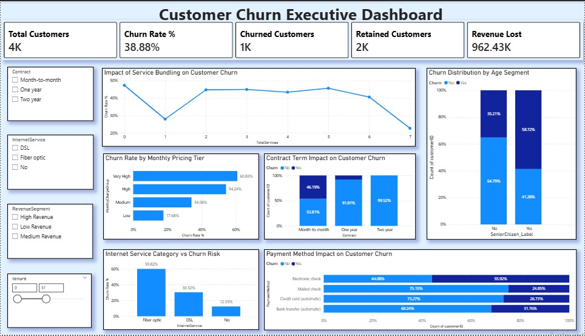

# Telecom Customer Churn Analytics Dashboard
End-to-end telecom customer churn analysis using Python (Google Colab) for data cleaning and feature engineering, and Power BI for interactive executive reporting.

---

## Problem statement

Telecom companies typically operate with high acquisition costs and recurring subscription revenue.
Customer churn directly reduces revenue and increases the cost of growth. This project focuses on 
identifying churn drivers across contract type, pricing tiers, service adoption, internet service 
category, and payment behavior, then presenting the results in an executive-ready Power BI dashboard.

---

## Project overview

This is an end-to-end analytics project covering:

- Data preparation and feature engineering in Python (Google Colab)
- Exploratory analysis of churn drivers
- Interactive reporting in Power BI with KPI tracking and slicer-based segmentation
- Actionable retention recommendations based on the findings

Dataset: IBM Telco Customer Churn 

---

## Dashboard preview

---

## Dashboard summary

The Power BI dashboard is built for two use cases:
1. Quick executive review of churn KPIs and revenue impact
2. Segment exploration using slicers to identify where churn concentrates

Key components included:
- KPI cards: Total Customers, Churn Rate, Churned Customers, Retained Customers, Revenue Lost
- Churn rate by monthly pricing tier (pricing sensitivity)
- Contract term impact on churn (retention by contract duration)
- Service bundling effect (relationship between number of services and churn)
- Churn risk by internet service type
- Payment method impact on churn
- Churn distribution by age segment (senior vs non-senior)

Slicers available:
- Contract
- InternetService
- RevenueSegment
- Tenure (range)

All visuals are filter-aware and update based on slicer selections.

---

## Executive KPIs (default dashboard view)

- Total customers: 4K  
- Churn rate: 38.88%  
- Churned customers: 1K  
- Retained customers: 2K  
- Revenue lost: 962.43K  

---

## Key insights

### 1) Churn increases sharply at higher pricing tiers
Churn rate by monthly pricing tier:
- Low: 17.68%
- Medium: 34.06%
- High: 54.24%
- Very High: 68.83%

This indicates a strong price-sensitivity pattern: churn risk rises as customers move into higher monthly charge tiers.

### 2) Payment method is a meaningful churn signal
Churn share by payment method (from the payment method comparison):
- Electronic check: 55.92% churn
- Bank transfer (automatic): 31.76% churn
- Credit card (automatic): 26.73% churn
- Mailed check: 24.85% churn

Electronic check users represent the highest churn-risk payment segment.

### 3) Service bundling correlates with improved retention
Churn rate trends downward as customers adopt more services, supporting bundling/cross-sell as a retention lever.

---

## Retention recommendations

1. Pricing-tier retention strategy  
   Prioritize retention offers for high-risk pricing tiers where churn exceeds 54% (High and Very High).

2. Contract conversion programs  
   Incentivize month-to-month customers to shift to longer contract terms using time-bound discounts, value-add bundles, or loyalty benefits.

3. Bundling and cross-sell  
   Target customers with low service adoption and offer bundles (or discounted add-ons) to increase stickiness and reduce churn risk.

4. Payment method optimization  
   Reduce churn in the electronic check segment by encouraging autopay options (bank transfer/credit card) using small incentives and simplified enrollment.

---

## Methodology

Python (Google Colab):
- Data quality checks (types, blanks, duplicates)
- Cleaning and preparation (notably TotalCharges conversion and blank handling)
- Feature engineering (tenure grouping, pricing tiers, revenue segments, total services, churn flag)
- Exploratory churn analysis to validate business drivers

Power BI:
- Data model built on the engineered dataset
- DAX measures for KPIs (churn rate, revenue lost, retained customers)
- Interactive dashboard design with slicers for segment exploration

---

## Conclusion

This project demonstrates an end-to-end churn analytics workflow, converting raw telecom customer
data into a clean, feature-engineered dataset and an executive Power BI dashboard. The analysis 
shows that churn is strongly influenced by commercial and behavioral factors such as contract term,
monthly pricing tier, payment method, internet service type, and the level of service adoption.
The dashboard enables stakeholders to quickly identify high-risk segments, quantify revenue impact, and
prioritize targeted retention actions such as contract conversion, pricing-tier interventions, service
bundling offers, and payment method optimization.

---

## Author

Name: Jiya Attar

Aspiring Data Analyst | Python | Power BI | Excel 
